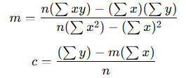

# 1.Machine Learning ?
- Hum machine ko data dete h and machine uss data se learn karta h and find patterns and jab tm uss data se related koi question puchoge to uska answer milega. (jitna jyada data and good algorithm then utna accha prediction)

simply,
ML = Data + Algorithms → Learn Patterns → Make Predictions

# 2. Types of Machine Learning

i. Supervised Learning
- data are labelled
- labelled data - input ke sath uska output given hota h
- humne model train kar diya ki kiss input ke liye output kya h , fir Phir jab naya input mile — to model correct output predict kar deta hai.

Ex:- Email spam detection , Price prediction ,  Medical field

ii. Unsupervised Learning
- data are not labelled

iii. Reinforcement Learning
Socho tum video game khel rahe ho.
Koi direct guide nahi, par jab sahi move karte ho toh points milte hain,
galti karte ho toh life chali jaati hai 😅
Dheere-dheere tum samajh jaate ho — “kaunsa move best hai!”

💡 Same logic in ML:
Agent environment mein action leta hai.
Us action ke basis par reward ya punishment milta hai.
Goal: zyada se zyada reward earn karna.
Model try–error karke best strategy seekhta hai

# 3. Overfitting vs Underfitting
Machine Learning ka main goal hota hai —
"Data se seekhna, aur naye data par sahi predict karna."
Lekin kabhi model zyada seekh leta hai,
aur kabhi kam seekhta hai

* Underfitting - Model ne data achhe se seekha hi nahi .
             - Model ne data samjha hi nahi.

* Overfitting -  Model ne data itna yaad kar liya ki naya question dekhke confuse ho gya.
            -  Model training data pe perfect, par new data pe fail.

# 4. Regression aur Classification
- Regression mein hum numbers (continuous values) predict karte hain.
Example:
Ghar ka price predict karna (₹25 lakh, ₹50 lakh, ₹1 crore)
Temperature predict karna (29.5°C, 32.7°C)

- Classification mein hum categories ya classes predict karte hain.
Example:
Email spam hai ya nahi? (Spam / Not Spam)
Tumhare photo mein dog hai ya cat? (Dog / Cat)
Student pass hua ya fail? (Pass / Fail)

# 5. Regression
- Prediction of continuous value,means koi number ya quantity predict karna.
- Example: Ghar ki price predict karna , Student ke marks predict karna

i. Linear Regression
- old data se pattern sikhta h and fir new data par prediction karta h.
- y=mx+c  (x-independent variable , y - dependent variable)

ii. Polynomial Regression
- y=b0​+b1​x+b2​x^2+b3​x^3+...+bn​x^n

* Note:- if x is known so how to find y , m , c
step1: humare paas x and y ka value diya hoga i.e, training dataset
iske help se hum m and c find kar lenge.
| x (Hours Studied) | y (Marks) |
| ----------------- | --------- |
| 1                 | 40        |
| 2                 | 50        |
| 3                 | 65        |
| 4                 | 75        |

step2: use this formula to finc m and c

Now , we get m and c

step2: now kisi bhi particular new x point ke liye y find kar lenge.

Ex:- Netflix algorithm thousands of users ka data use karke m aur c find karta hai (pattern between x & y).
Phir naye user ke liye predict karta hai — “Agar ye itna comedy dekhta hai, to usse ye rating pasand aayegi.”

# 6. SVM (Support Vector Machine)
- ye classification ke liye bana tha — jaise: Ye image cat ki hai ya dog ki?
- SVM ek boundary line(hyperplane) banata hai jo classes ko alag karta hai

# 7. Decision Tree
- It is a Supervised Machine Learning used for both Classification aur Regression.
* Yeh algorithm ek tree structure me decisions banata hai:
        - Root Node: jahan se decision start hota hai
        - Internal Nodes: jahan condition lagti hai
        - Leaf Node: final output

* Example : - Bank tmhe credit card dega ya nhi ?
     Feature: Income , Credit Score , Age

    Tree:-
                   [Credit Score > 700?]
                 /             \
              Yes               No
             /                    \
    [Income > 50K?]          Reject Loan
       /       \
    Yes         No
   /             \
Approve Loan    Reject Loan

* Features:-
i.Handles both categorical and numerical data.
ii.Easy to understand and visualize
iii. No need for feature scaling

* Disadvantages
i. Overfitting
ii. Sensitive to small changes – Slight changes in data can change the tree structure.

* Decision Tree do tarah ke problems ke liye use hota hai: 
      - Classification Tree (Jab output categorical ho)
      - Regression Tree (Jab output numeric ho)

# 7. Bagging and Boosting

* Bagging
- Original data me se randomly kuch data ko select kro
- ab random select kiya hua data pe decision tree train karo.
- jiska majority sabse jyada hoga wahi output hoga.
- Predictions combine karo:
        Classification: majority vote
        Regression: average/mean

    Classification- Jab output category/label ho (jaise Yes/No, 0/1, Cat/Dog)
    Regression- Jab output numerical value ho (jaise price, age, temperature)

- Original data ka randomly select kiya hua part, jisme same data point repeat ho sakta hai

- Example: Random Forest follows bagging technique

- real life:- Ek question ke liye 10 students independently answer dete hain → majority ka answer final hota hai.

* Boosting
- Pehla tree train karo.
- Jo points galat predict hue → unko zyaada importance (weight) do.
- Agla tree sirf un galti points ko better predict karne ki koshish kare.
- Repeat karte jao → final prediction = sab trees ka weighted combination

- real life:- Ek student step by step apni mistakes  se seekh raha hai → next attempt me galti kam hoti hai

# 8. Random Forest
- It is an extension of Decision Tree.
- It removes the problem of Decision Tree.
- ye algorithm multiple Decision Trees banata hai, aur unka average (regression) ya majority vote (classification) leta hai.
- Decision Tree me hum ek dataset se 1 tree create karte h and random forest me hum multiple tree create karte h and multiple Decision Tree milke forest banata h.
- Decision Tree me overfitting ka problem tha usko Random Forest solve kar deta h.
- Isko hum Bagging technique bolte hain.
   Yaani ek single model par bharosa na karke multiple trees ka opinion liya jata hai.
- Har tree thoda alag data aur features pe train hota hai.
  Sab trees milke decision lete hain.

* steps:-
i.Random Forest randomly picks subsets of data (rows) from the original dataset to make each tree.
ii.Each Decision Tree is grown fully
iii.final output
    - Classification : jo tree majority me jo output dega wo final output hoga
    - Regression : Takes average of all tree outputs

# 9.Cross Validation
Tum ek student ho.
Tumhe ek exam (model test) dena hai, aur tumhare paas 100 sawal (data) hain.
Tum apni performance check karna chahte ho.

* Normal Train-Test Split
Tum kya karte ho:
  - 80 sawal se practice (train) karte ho
  - 20 sawal se test karte ho

👎 Problem:
Ho sakta hai wo 20 sawal aasaan nikle → tumhara score zyada aayega.
Ya mushkil nikle → score kam aayega.

To tumhe apna asli level pata nahi chalega.

solution:-
step-1:- Data ko parts  me divide kro
Maan lo tumhare paas 100 data points hain.
Tum unhe 5 parts me baant lete ho →
(F1, F2, F3, F4, F5)
👉 Ye 5 parts ko hum folds bolte hain.

step-2:- haar baar ek part ko test set ke roop me use karo and remaining part ko training ke roop me use kro

Ab tum 5 baar model chalaoge.
Har baar ek alag fold test ke liye loge,
baaki 4 folds training ke liye.

Step 4:- Phir sab results ka average le lete hain
Tumhe har round ka ek accuracy milti hai:
Ab in sabka average nikal lo:Ye hi final accuracy hai

# 10. R-squared (R²)

# 11. # 📘 Logistic Regression

**Logistic Regression** ek **classification algorithm** hai jo **categorical output** (like **Yes/No**, **0/1**, **Pass/Fail**) predict karta hai.

---

## 🔍 Linear Regression vs Logistic Regression

| **Feature** | **Linear Regression** | **Logistic Regression** |
|--------------|------------------------|---------------------------|
| **Type** | Regression (Continuous output) | Classification (Categorical output) |
| **Output** | Real value (−∞ to +∞) | Probability (0 to 1) |
| **Function used** | Linear function | Sigmoid (logistic) function |
| **Goal** | Predict continuous values (e.g. salary, marks) | Predict class (e.g. pass/fail, spam/not spam) |
| **Error function** | Mean Squared Error (MSE) | Log Loss (Cross Entropy) |
| **Decision boundary** | Straight line | S-shaped (Sigmoid curve) |
| **Example** | Predict house price | Predict whether email is spam or not |

---

## 🧠 In Short

- **Linear Regression** → continuous **values** predict karta hai  
- **Logistic Regression** → categorical **class (Yes/No)** predict karta hai ✅

# 12. CAP Curve
- used for classification models
- 

# 13.XGBoost

