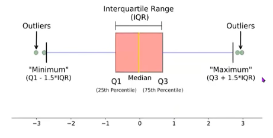
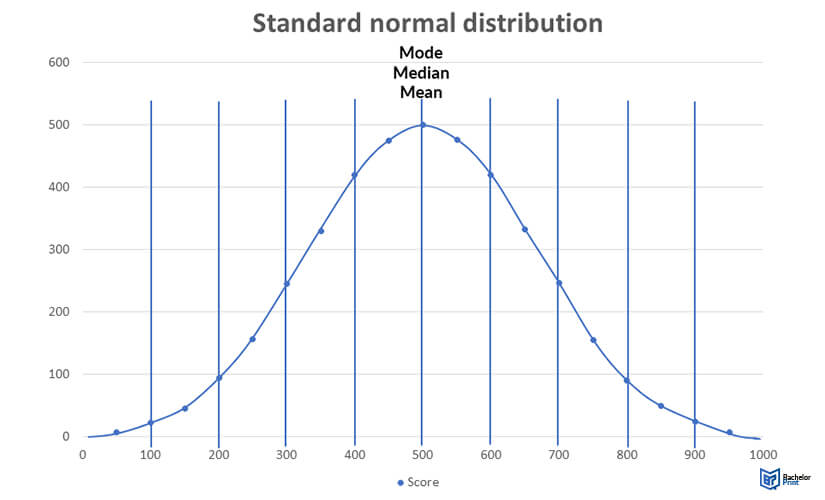

# Topics to be covered

# 1. Raw data vs Information
Raw data - meaningless data
Information - meaningfull data

* statistics is used to convert raw data into information and used to make predictions ,decisions.

# 2. Population vs Sample
    # a. Population : Entire dataset jispe hum study kar rahe hain.
        # Ex: Poore India ke students.
   
    # b. Sample : Population ka chhota hissa jise study ke liye select kiya gaya ho.
        # Ex: Sirf 500 students jo randomly select kiye gaye ho.

# 3. Types of Statistics :-
     a. Descriptive
        “Apne data ko summarize  karna” taaki wo easily samajh mein aaye.
          Yaani agar tumhare paas bohot saara data hai, to descriptive statistics usse summarize form mein batata hai — jaise average, highest, lowest, spread, etc.   
      common techniques - Mean, Median, Mode , Range , Graphs

     b. Inferential
        Chhote sample ke basis par bade group (population) ke baare mein andaza lagana ya decision lena.
      common techniques - Regression & Correlation , Hypothesis Testing (t-test, z-test, ANOVA, Chi-square)

      Real-life Example:
       1. A company can’t ask every customer their satisfaction level.
        So they take a sample of 500 customers and find: 80% are satisfied
        → Then infer: “Probably, about 80% of all customers are satisfied.”

        2. In elections, exit polls collect data from few voters (sample)
        and predict the result for the whole country (population) — that’s inferential statistics!

# 4. Measures of Central Tendency
- "Measures of Central Tendency" ka matlab hota hai — data ka ek central value jo poore data ko represent kare.
- Ye value hume batati hai ki data ke values kis ke aas-paas concentrate karte hain.

Types of Central Tendency:- Mean, Median, Mode

* variance -  mean se saara value kitna dur h.
* Range - difference b/w maximum and minimum

* Percentile batata hai ki kisi value se neeche kitna percent data aata hai.
Ex:- Agar tumne kisi exam mein 90th percentile score kiya,
it means, Tumne 90% students se better perform kiya hai,
aur sirf 10% students tumse better hain.

* Quartiles                 Q1 ,  Q2 ,  Q3  , Q4
ye 4 part me divide hota h (25% , 50% , 75% , 100%)

IQR = Q3-Q1

* Outliers
pure dataset me jo odd value hoga.
EX:- 1,2,3,5,7,100 -> here 100 is outlier
Ex:- 

* Box plot se hum outlier find karte h

* correlation - relationship b/w columns (if i change in one column then what is the effect in another column )

3 types of correlation:- directly proportional , inversely proportional , zero(no effect)
- for correlation we use HEAT map .

# 5.Probability
- koi bhi event hone ka chance.

Types of probability - marginal , joint , conditional

# 6. Variables: Qualitative and Quantitative
    - Variable wo hota hai jo change hota rahta hai
    
    (a) Qualitative (Categorical) Variable:
        - Ye quality ya category batata hai, number nahi.
        - Example: Gender (Male/Female), Blood group (A, B, O, AB)

    (b) Quantitative Variable:
        - Ye numbers me hota hai, jise measure kiya ja sakta hai.
        - Example: Height, Weight, Age, Marks

# 7. Primary and Secondary Data 
   Primary Data :- Jo data directly source se collect kiya gaya ho — khud survey, experiment, ya observation

   Secondary Data:- Jo data pehle se collect aur publish kiya gaya ho — jaise books, reports, government records, websites, etc.

# 8. Correlation and Regression
- Correlation ka matlab hota hai do variables ke beech relationship ko measure karna.
- Yaani ek variable increase ya decrease par dusre variable me kya change aata hai.
- Correlation batata hai do variables ke beech relationship ki magnitude and direction both.

Types of Correlation:-
- Positive Correlation - ek increase hoga to dusra bhi increase hoga or ek decrease hoga to dusra bhi decrease hoga.

- Negative Correlation - ek increase hoga to dusra bhi decrease hoga

- Zero Correlation - dono variable ke bich me koi bhi relationship nhi h.

* Covariance
  - similar to Correlation , but isme sirf dono variable ka beech ka direction batata h.
  - Types is similar to Correlation

# 9. means is sensitve to outliers
if the graph is skewed  then ,it is good to find median ,(donot find mean)

Ex:- salary(in LPA) - 3,5,6,5,4,8,11,10,50,80
if we find mean then, ( 3+5+6+5+4+8+11+10+50+80 ) / 10 = 18.2 LPA
the is not realistic.

so,we find median ,=> 3,4,5,5,6,8,10,11,50,80 = (6+9)/2=7

Note:- yaha 50,80 right skewed kar dega (i.e, right side me long tail kar dega)

# 10.Normal Distribution
- Curve symmetrical hoti hai (dono sides same).
- Mean = Median = Mode hota hai.
- Maximum data average ke paas hota hai. (at center top)
- Jaise-jaise mean se door jaate ho, frequency (no. of people) kam hoti jaati hai. (left or right kisi bhi side jane se)
- Graph - 

# 11. Hypothesis Testing
- It is an assumption that we make about the population
- pehle hum ek assumption banate hain,phir usko data ke help se test karte hain — agar data support kare to assumption ko maan lete hain, warna assumption ko reject kar dete hain.

- hypothesis tests ka main goal hota hai: sample data se population ke baare me conclusion nikalna.

i.Null hypothesis

ii.Alternative Hypothesis

iii.Significance Level

iv.p-value

# 12. Common Hypothesis Tests (z, t, ANOVA, Chi-square test)

1️⃣. Z-test:
    - Humare paas large sample ho (usually n > 30)
    - Population ka standard deviation (σ) pata ho
    - To compare sample mean and population  mean 

    Real-life Example
      - School claims: Average height of 16-year-old boys = 170 cm
      - You measure 50 boys: Sample mean = 168 cm
      - standard deviation of Population  (σ) = 5 cm
      Use Z-test to check: “Is the school claim correct?”

    Types of Z-test:- 
      i.one-sample z-test :- single sample mean ko population ke mean se compare kar rhe h.
      ii.two-sample z-test :- ek sample mean ko dusre sample mean se compare kar rhe h.

2️⃣. T-Test
    - Small sample (n < 30)
    - Population standard deviation (σ) are unknown

Types of T-tests: same as Z-test

Real-life Example
- Company wants to check if training improves productivity.
- Sample of 20 employees: Before training average output = 50 units, After training = 55 units
- Use paired t-test to see if increase is significant.

3️⃣. ANOVA (Analysis of Variance) or F-Test
    - when i want to compare the mean of more than 2 groups or more than 2 samples
    - Simple z-test or t-test me sirf 2 samples or sample or population ke liye hota hai

  Types of ANOVA:-
   i.one way ANOVA

   i.two way ANOVA

4️⃣ Chi-Square Test
   - categorical data ke liye use hota hai
   - Check karta hai: “Kya observed frequency aur expected frequency me difference hai ya nahi?”

Note:- i. large sample means, data me variation hona chahiye(i.e, different types/values include ho) and uss Data se reliable conclusions nikal sake.

ii. Small datasets are used when large datasets are not practical, possible, or collecting larget data is not possoble, yet statistical techniques allow us to make reasonably correct conclusions.

# 13. one-tailed Test and two-tailed Teat

# 14. Regression
